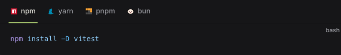

# TODO:

# Project Setup Vite 
npm create vite@latest OR use npm create vite@latest .

# Add this vite config to your project root (this allows you to add multiple files under source)
## NOTE - to add a new lab, add a folder under src and then and an index.html if needed.
// vite.config.js
import { defineConfig } from 'vite';
import { resolve } from 'path';
import fs from 'fs';

// Resolve the path to the labs directory
const labsDir = resolve(__dirname, 'src');

// Dynamically find all lab folders
const labs = fs.readdirSync(labsDir)
    .filter(file => fs.statSync(resolve(labsDir, file)).isDirectory() && file.startsWith('lab'));

// Build the input object for Vite
const input = {};
labs.forEach(lab => {
    input[lab] = resolve(labsDir, lab, 'index.html');
});

// The final Vite configuration
export default defineConfig({
    build: {
        rollupOptions: {
            input,
        },
    },
});

# Add Vitest

